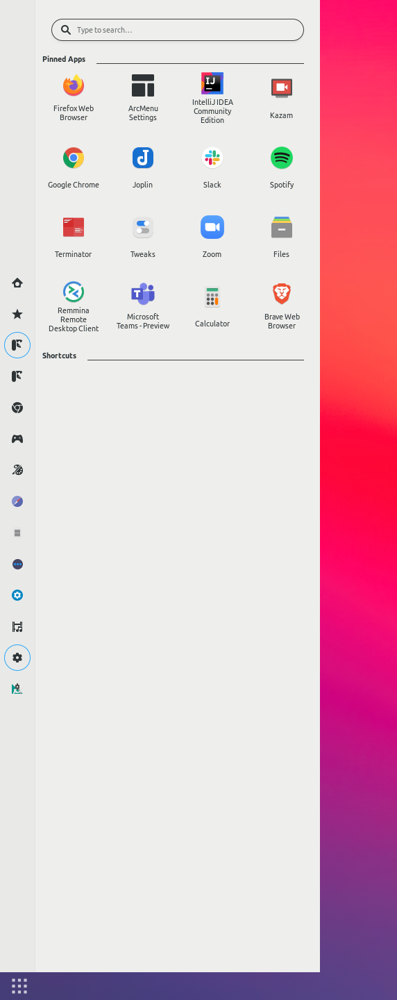

# Dotfiles

Dotfiles and some customisation/theming notes.

## GNOME Tweaks

- https://gitlab.gnome.org/GNOME/gnome-tweaks
- `gnome-tweaks`

### Gnome Extensions

| Name | Description | Link |
|------|-------------|------|
| `Clipboard indicator` | Caches clipboard history. | https://extensions.gnome.org/extension/779/clipboard-indicator/ |
| `Dash to Panel` | Moves the dash into the gnome main panel so that the application launchers and system tray are combined into a single panel. | https://extensions.gnome.org/extension/1160/dash-to-panel/ |
| `ShellTile` | Snap windows, including corner snapping. | <ul><li>https://extensions.gnome.org/extension/657/shelltile/ </li><li>https://github.com/emasab/shelltile </li></ul> |
| `Sound input & output device chooser` | Shows a list of sound output and input devices. | https://extensions.gnome.org/extension/906/sound-output-device-chooser/ |
| `Bring Out Submenu Of Power Off/Logout Button` | Bring out submenu of power off/logoff button. | https://extensions.gnome.org/extension/2917/bring-out-submenu-of-power-offlogout-button/ |
| `Applications view columns` | Set the number of columns in the applications overview. (Set to 11) | https://extensions.gnome.org/extension/2159/application-view-columns/ |
| `Night light slider` | Manage the built-in night light temperature. | https://extensions.gnome.org/extension/1276/night-light-slider/ |
| `Vitals` | Monitor computer sensors. | https://extensions.gnome.org/extension/1460/vitals/ |

Settings: `saved_settings.dconf`
- `dconf dump / > saved_settings.dconf`
- `dconf load / < saved_settings.dconf`

#### Dash to Panel

- Moves the dash into the gnome main panel so that the application launchers and system tray are combined into a single panel.
- https://extensions.gnome.org/extension/1160/dash-to-panel/
- https://github.com/home-sweet-gnome/dash-to-panel
- Import settings from `dash_to_panel_settings`:
  - `Tweaks` &rightarrow; `Extensions` &rightarrow; `Dash To Panel` &rightarrow; :gear: (Settings) &rightarrow; `About` &rightarrow; `Export and import settings` &rightarrow; `Import from file` &rightarrow; `dash_to_panel_settings`

#### ArcMenu

- https://extensions.gnome.org/extension/3628/arcmenu/
- https://gitlab.com/arcmenu-team/Arc-Menu
- Import settings from `arc_menu_settings`:
  - `ArcMenu Settings` &rightarrow; `Misc` &rightarrow; `Export or Import Settings` &rightarrow; `All ArcMenu Settings` &rightarrow; `Import from File` &rightarrow; `arc_menu_settings`

## Appearance

### Theme

(Change in `Tweaks` &rightarrow; `Appearance`)

- Applications: `Ant-Dracula-alt (green)`
  - Theme customised to green (#7cae0f)
  - https://www.gnome-look.org/p/1099856/
  - https://github.com/EliverLara/Ant
  - Add to `~/.themes`

- Cursor: `Sweet-cursors`
  - https://www.gnome-look.org/p/1393084/
  - Add to `~/.icons`

- Icons: `Papirus`
  - https://github.com/PapirusDevelopmentTeam/papirus-icon-theme
  - https://www.gnome-look.org/p/1166289/

- Shell: `ChromeOS`
  - https://github.com/vinceliuice/ChromeOS-theme
  - https://www.gnome-look.org/p/1335019/
  - Add to `~/.themes`

### Slack theme

`#1A1D21,#000000,#4999C4,#FFFFFF,#000000,#FFFFFF,#84F75E,#B53333,#000000,#FFFFFF`

| Name | Hex | Preview |
|------|-----|---------|
| Column BG | `#1A1D21` |  |
| Active item | `#4999C4` |  |
| Active item text | `#FFFFFF` |  |
| Hover item | `#000000` |  |
| Text colour | `#FFFFFF` |  |
| Active presence | `#84F75E` |  |
| Mention badge | `#B53333` |  |
| Top nav BG | `#000000` |  |
| Top nav text | `#FFFFFF` |  |

## Other

### Boot manager & theme

- rEFInd: http://www.rodsbooks.com/refind/
- rEFInd theme Regular: https://github.com/bobafetthotmail/refind-theme-regular

### To add

- `Ant-Dracula-alt (green)` theme
- aliases
- applications
